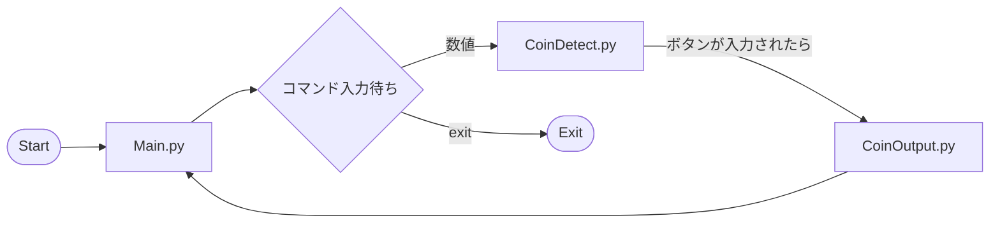

```mermaid

flowchart LR

    Start([Start])-->Main.py
    Main.py-->TextInput{コマンド入力待ち}
    TextInput-->|数値| CoinDetect.py
    TextInput-->|exit| Exit([Exit])
    CoinDetect.py-->|ボタンが入力されたら| CoinOutput.py
    CoinOutput.py-->Main.py

```
